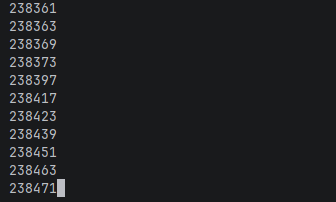
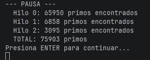
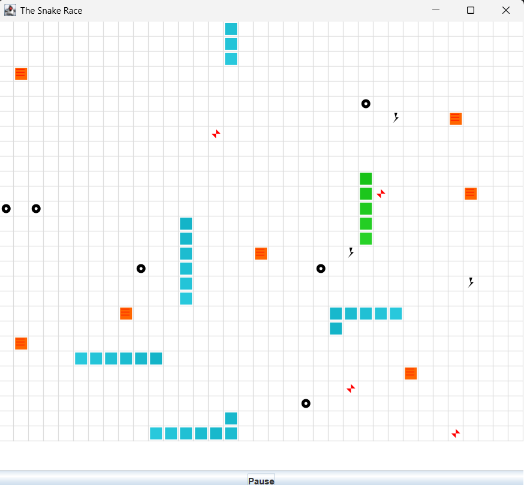
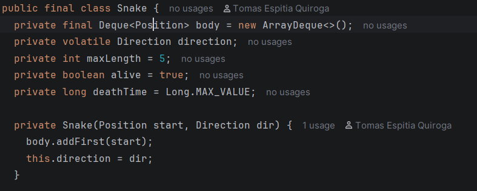
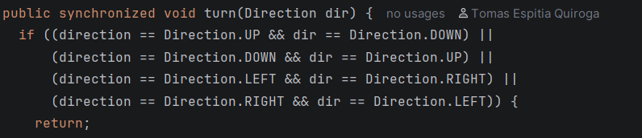
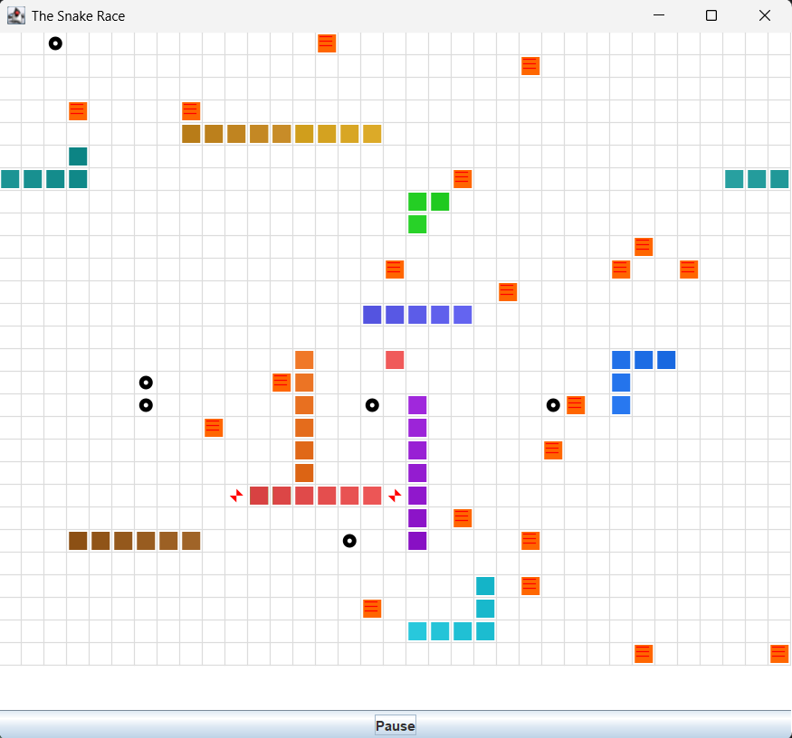
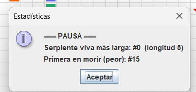

## Parte I — (Calentami pento) `wait/notify` en un programa multi-hilo
## ¿Qué hace el programa?

El programa busca números primos entre 0 y 30.000.000 usando 3 hilos trabajadores que se reparten el rango. Cada 5 segundos todos los hilos se pausan, se imprime cuántos primos lleva cada uno, y el programa espera a que el usuario presione ENTER para continuar.

---

## ¿Cómo se sincroniza?

El objeto **Control** actúa como monitor compartido. Tiene un flag booleano **paused** que los hilos trabajadores consultan en cada iteración llamando a **checkPause()**.
Cuando **Control** activa la pausa (**paused = true**), los hilos que llegan a **checkPause()** ejecutan **wait()** y se bloquean ahí, liberando el CPU. No hay espera activa en ningún punto.
Una vez que el usuario presiona ENTER, **Control** pone **paused = false** y llama **notifyAll()**, lo que despierta a todos los hilos al mismo tiempo para que continúen desde donde se quedaron.
El **while (paused)** dentro de **checkPause()** (en lugar de un **if**) protege contra *spurious wakeups*, que son casos donde **wait()** puede retornar sin haber recibido un **notify**. Así el hilo vuelve a verificar la condición antes de continuar.

---
## Clases modificadas

**PrimeFinderThread** – se le agregó una referencia al **Control** y se llama **checkPause()** en cada iteración del loop principal.

**Control** – se agregó el flag **paused**, el loop del temporizador en **run()**, y el método **checkPause()** sincronizado.
 
---
## Evidencia de ejecución
### El programa arranca y los hilos empiezan a imprimir primos

### A los 5 segundos aparece la pausa con el conteo por hilo

### Después de presionar ENTER los hilos retoman

---

## Observaciones

Algo que noté al correrlo es que el conteo no es exactamente el mismo entre hilos porque cada rango tiene diferente densidad de primos. El hilo 0 cubre los números más pequeños donde hay más primos por unidad de rango, así que siempre va más adelantado que los otros dos.

El **sleep(50)** que tiene **Control** justo después de activar la pausa es para darle margen a los hilos de que lleguen a su **checkPause()** antes de imprimir las estadísticas. Sin ese sleep podría imprimirse el conteo con algún hilo todavía corriendo.

---

## Parte II — SnakeRace concurrente (núcleo del laboratorio)

## 1. Análisis de concurrencia

### Cómo el código usa hilos

Snake Race le da a cada serpiente su propio hilo independiente usando virtual threads de Java 21. Al arrancar la aplicación, se crea un **SnakeRunner** por serpiente y se envía a un **VirtualThreadPerTaskExecutor**, que asigna automáticamente un hilo virtual a cada uno.

Dentro de su hilo, cada serpiente corre un loop infinito de forma independiente. En cada iteración decide si cambiar de dirección, avanza un paso en el tablero, reacciona a lo que encuentra (ratón, obstáculo, turbo o teletransporte) y duerme 80ms (o 40ms si tiene turbo activo) antes de repetir.

La UI corre por separado en el Event Dispatch Thread (EDT) de Swing. Un **GameClock**  dispara un repintado cada 60ms usando **SwingUtilities.invokeLater()**, manteniendo la actualización visual desacoplada de los hilos de movimiento.

### Problemas de concurrencia identificados

**Posibles condiciones de carrera**

Si dos serpientes comen un ratón al mismo tiempo, ambos hilos intentan agregar nuevos elementos al tablero simultáneamente, lo que puede dejar las colecciones en un estado inconsistente o colocar dos elementos en la misma posición.

El método **randomEmpty()** no estaba protegido, entonces dos hilos podían escoger la misma posición vacía para un nuevo elemento al mismo tiempo.

**Colecciones no seguras en contexto concurrente**

**Snake.body** es un **ArrayDeque**, que no es thread-safe. El hilo de la serpiente escribe en él a través de **advance()** mientras el EDT lo lee a través de **snapshot()** para dibujarlo en pantalla, lo que puede causar un **ConcurrentModificationException**.

**Espera activa y sincronización innecesaria**

El **GameClock** seguía disparando cada 60ms incluso al pausar, gastando CPU innecesariamente. Además, presionar el botón solo detenía el repintado pero los hilos de las serpientes seguían corriendo en segundo plano, es decir, las serpientes continuaban moviéndose aunque la pantalla pareciera congelada.
 
---

---

## 2. Correcciones mínimas y regiones críticas

- **Snake.advance()** y **snapshot()** se sincronizaron para evitar el data race entre el hilo de la serpiente escribiendo el cuerpo y el EDT leyéndolo para pintarlo en pantalla.
- **Board.step()** se sincronizó para que múltiples hilos no puedan comer el mismo ratón ni colocar elementos en la misma posición al mismo tiempo.
- **Board.randomEmpty()** está protegido dentro del bloque sincronizado de **step()**, garantizando que dos hilos nunca escojan la misma posición vacía al agregar nuevos elementos.
- **Snake.turn()** se sincronizó porque aunque **direction** era **volatile**, el bloque check-then-write no es atómico. La combinación **volatile + synchronized** es redundante pero correcta.
- Se rediseñó **Board.step()** para leer los datos de la serpiente **antes** de tomar el lock del tablero y llamar **snake.advance()** **después** de soltarlo. Esto elimina el riesgo de deadlock que existía cuando los locks de **snake** y **board** se adquirían de forma anidada en orden inverso.
- La pausa se implementó con **wait()**/**notifyAll()** sobre el propio **Board**. Cada runner llama **checkPause()** al inicio de su tick y se suspende ahí si el juego está pausado, sin gastar CPU.
---

---

## 3. Control de ejecución seguro (UI)

El botón alterna entre **Pause** y **Resume** usando un **AtomicReference<GameState>** en vez de un boolean, aprovechando el enum **GameState** que ya existía en el proyecto.

El detalle más importante fue que **togglePause()** se ejecuta en el EDT, por lo tanto no se puede bloquear ahí esperando a que todos los runners lleguen a su punto de pausa. La solución fue lanzar un hilo aparte que llama `waitUntilAllPaused()`, y solo cuando todos los runners están dentro del `wait()` se vuelve al EDT para mostrar las estadísticas. Así el estado mostrado (serpiente más larga, primera en morir) está garantizado de ser consistente porque ningún runner está corriendo en ese momento.
 
---

---

## 4. Robustez bajo carga

El juego fue probado con **-Dsnakes=20** y valores mayores. No se observaron **ConcurrentModificationException** ni deadlocks. La sincronización aplicada a **Board.step()**, **Snake.advance()** y **Snake.snapshot** garantiza que incluso con un número alto de hilos concurrentes el juego se mantiene estable.

El mecanismo de pausa también funciona correctamente bajo carga, suspendiendo y reanudando todos los hilos de forma consistente sin dejar el juego en un estado intermedio. Las serpientes muertas desaparecen del mapa inmediatamente porque **paintComponent** filtra por **isAlive()**, y su runner termina limpiamente a través del bloque **finally** que llama **unregisterRunner()**.
 
---
