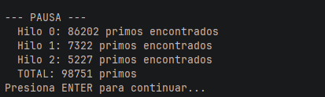

## Parte I — (Calentamiento) `wait/notify` en un programa multi-hilo
## ¿Qué hace el programa?

El programa busca números primos entre 0 y 30.000.000 usando 3 hilos trabajadores que se reparten el rango. Cada 5 segundos todos los hilos se pausan, se imprime cuántos primos lleva cada uno, y el programa espera a que el usuario presione ENTER para continuar.

---

## ¿Cómo se sincroniza?

El objeto **Control** actúa como monitor compartido. Tiene un flag booleano **paused** que los hilos trabajadores consultan en cada iteración llamando a **checkPause()**.
Cuando **Control** activa la pausa (**paused = true**), los hilos que llegan a **checkPause()** ejecutan **wait()** y se bloquean ahí, liberando el CPU. No hay espera activa en ningún punto.
Una vez que el usuario presiona ENTER, **Control** pone **paused = false** y llama **notifyAll()**, lo que despierta a todos los hilos al mismo tiempo para que continúen desde donde se quedaron.
El **while (paused)** dentro de **checkPause()** (en lugar de un **if**) protege contra *spurious wakeups*, que son casos donde **wait()** puede retornar sin haber recibido un **notify**. Así el hilo vuelve a verificar la condición antes de continuar.

---
## Clases modificadas

**PrimeFinderThread** – se le agregó una referencia al **Control** y se llama **checkPause()** en cada iteración del loop principal.

**Control** – se agregó el flag **paused**, el loop del temporizador en **run()**, y el método **checkPause()** sincronizado.
 
---
## Evidencia de ejecución
### El programa arranca y los hilos empiezan a imprimir primos

### A los 5 segundos aparece la pausa con el conteo por hilo

### Después de presionar ENTER los hilos retoman

---

## Observaciones

Algo que noté al correrlo es que el conteo no es exactamente el mismo entre hilos porque cada rango tiene diferente densidad de primos. El hilo 0 cubre los números más pequeños donde hay más primos por unidad de rango, así que siempre va más adelantado que los otros dos.

El **sleep(50)** que tiene **Control** justo después de activar la pausa es para darle margen a los hilos de que lleguen a su **checkPause()** antes de imprimir las estadísticas. Sin ese sleep podría imprimirse el conteo con algún hilo todavía corriendo.

---

## Parte II — SnakeRace concurrente (núcleo del laboratorio)

### 1) Análisis de concurrencia

- Explica **cómo** el código usa hilos para dar autonomía a cada serpiente.
- **Identifica** y documenta en **`el reporte de laboratorio`**:
  - Posibles **condiciones de carrera**.
  - **Colecciones** o estructuras **no seguras** en contexto concurrente.
  - Ocurrencias de **espera activa** (busy-wait) o de sincronización innecesaria.

### 2) Correcciones mínimas y regiones críticas

- **Elimina** esperas activas reemplazándolas por **señales** / **estados** o mecanismos de la librería de concurrencia.
- Protege **solo** las **regiones críticas estrictamente necesarias** (evita bloqueos amplios).
- Justifica en **`el reporte de laboratorio`** cada cambio: cuál era el riesgo y cómo lo resuelves.

### 3) Control de ejecución seguro (UI)

- Implementa la **UI** con **Iniciar / Pausar / Reanudar** (ya existe el botón _Action_ y el reloj `GameClock`).
- Al **Pausar**, muestra de forma **consistente** (sin _tearing_):
  - La **serpiente viva más larga**.
  - La **peor serpiente** (la que **primero murió**).
- Considera que la suspensión **no es instantánea**; coordina para que el estado mostrado no quede “a medias”.

### 4) Robustez bajo carga

- Ejecuta con **N alto** (`-Dsnakes=20` o más) y/o aumenta la velocidad.
- El juego **no debe romperse**: sin `ConcurrentModificationException`, sin lecturas inconsistentes, sin _deadlocks_.
- Si habilitas **teleports** y **turbo**, verifica que las reglas no introduzcan carreras.

> Entregables detallados más abajo.

---

## Entregables

1. **Código fuente** funcionando en **Java 21**.
2. Todo de manera clara en **`**el reporte de laboratorio**`** con:
   - Data races encontradas y su solución.
   - Colecciones mal usadas y cómo se protegieron (o sustituyeron).
   - Esperas activas eliminadas y mecanismo utilizado.
   - Regiones críticas definidas y justificación de su **alcance mínimo**.
3. UI con **Iniciar / Pausar / Reanudar** y estadísticas solicitadas al pausar.

---

## Criterios de evaluación (10)

- (3) **Concurrencia correcta**: sin data races; sincronización bien localizada.
- (2) **Pausa/Reanudar**: consistencia visual y de estado.
- (2) **Robustez**: corre **con N alto** y sin excepciones de concurrencia.
- (1.5) **Calidad**: estructura clara, nombres, comentarios; sin _code smells_ obvios.
- (1.5) **Documentación**: **`reporte de laboratorio`** claro, reproducible;

---

## Tips y configuración útil

- **Número de serpientes**: `-Dsnakes=N` al ejecutar.
- **Tamaño del tablero**: cambiar el constructor `new Board(width, height)`.
- **Teleports / Turbo**: editar `Board.java` (métodos de inicialización y reglas en `step(...)`).
- **Velocidad**: ajustar `GameClock` (tick) o el `sleep` del `SnakeRunner` (incluye modo turbo).

---

## Cómo correr pruebas

```bash
mvn clean verify
```

Incluye compilación y ejecución de pruebas JUnit. Si tienes análisis estático, ejecútalo en `verify` o `site` según tu `pom.xml`.

---

## Créditos

Este laboratorio es una adaptación modernizada del ejercicio **SnakeRace** de ARSW. El enunciado de actividades se conserva para mantener los objetivos pedagógicos del curso.

**Base construida por el Ing. Javier Toquica.**
